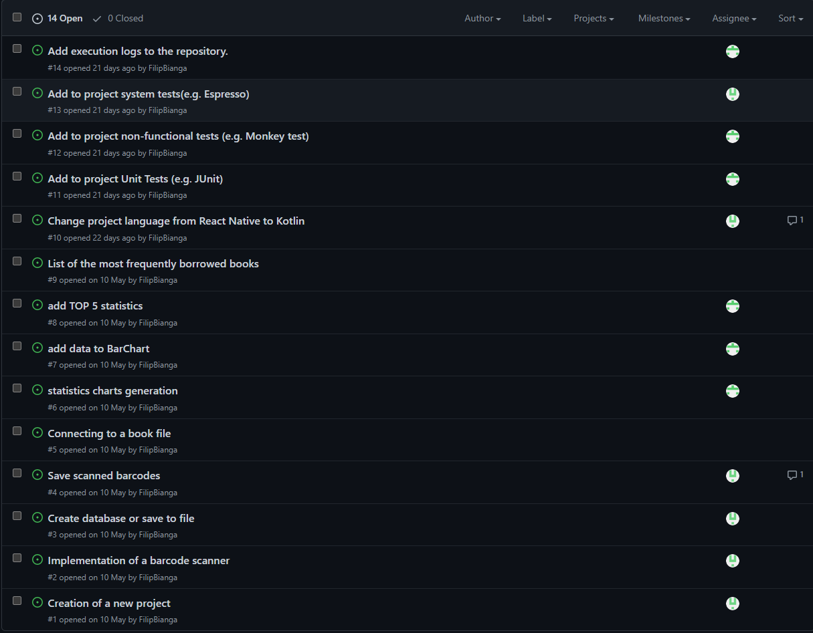
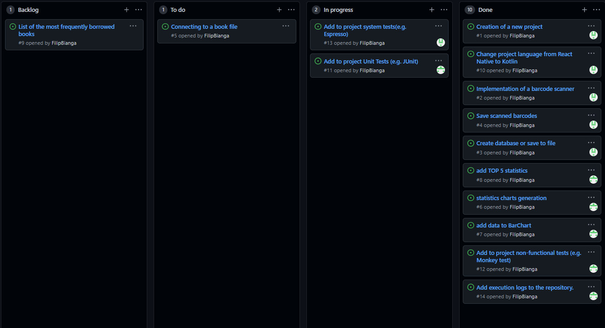
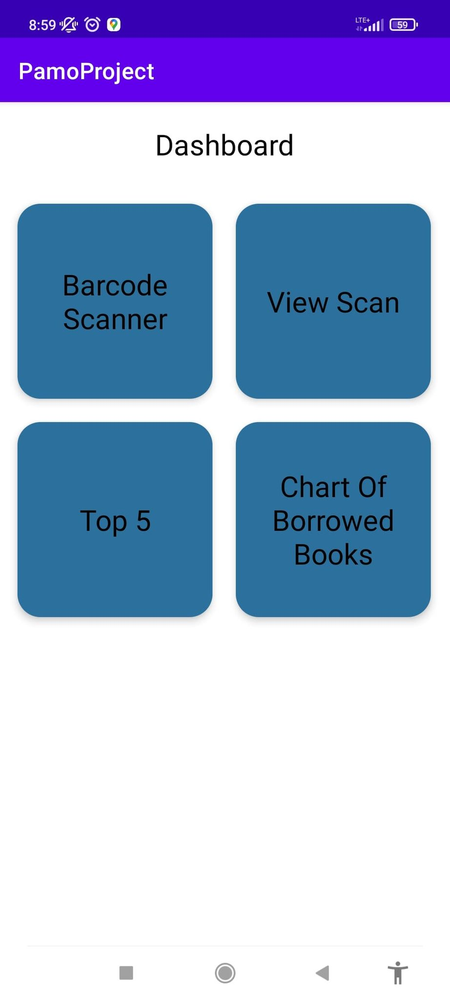
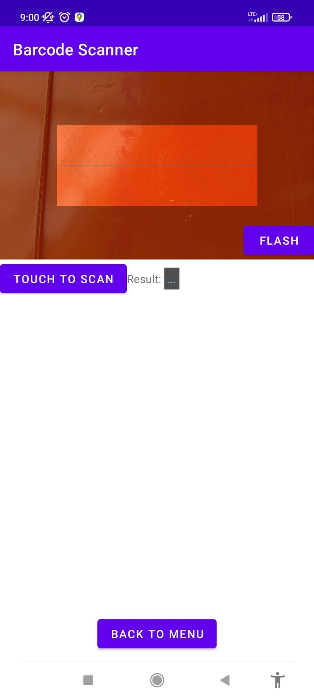
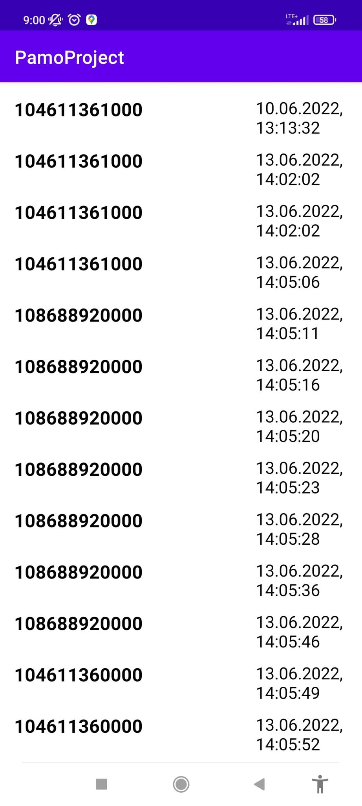
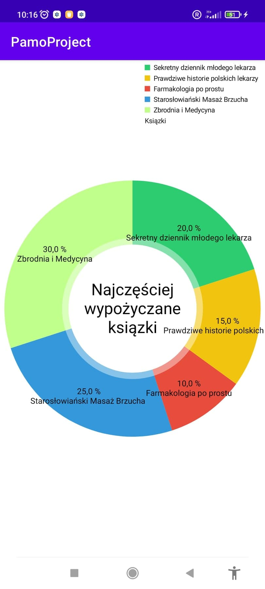
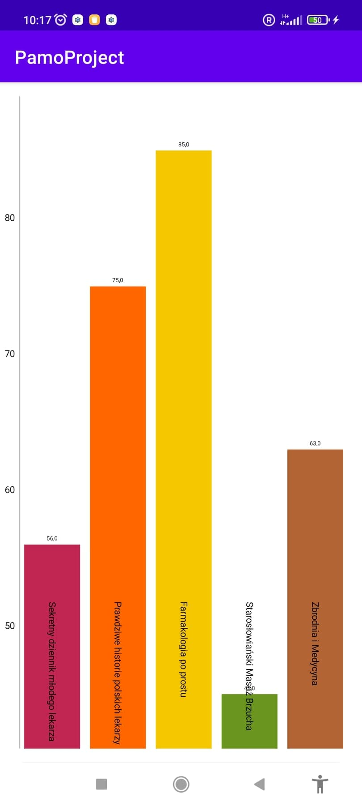

<h1 style="text-align: center;"><strong>Programowanie aplikacji mobilnych - Projekt </strong></h1>
<h2><strong>Temat: Statystyka Wypożyczeń</strong></h2>
<h3>Autorzy: Filip Bianga, Adrian Matyszczak</h3>
 

 
<h3><strong>Opis projektu:</strong></h3>

 Stworzenie aplikacji pozwalającej:
<ul>
    <li>Skanowanie kodów krekowych oraz kodów QR</li>
    <li>Zapisywanie oraz wyświetlanie zeskanowanych kodów</li>
    <li>Połączenie pliku z ksiązkami wraz z ich kodami by móc wyświetlać tytuły, zamiast kodów</li>
    <li>Utworzenie miesięcznej statystyki</li>
    <li>Najczęściej wypożyczane ksiązki</li>
    <li>Ilość wypożyczonych książek</li>
    <li>Napisanie testów jednostkowych</li>
    <li>Napisanie testów niefunkcjonalnych</li>
    <li>Napisanie testów systemowych</li>
</ul>

 

Wykonanie projektu

Zadania do wykoniania

Podzial zadan

Wykonane zadania
<ul>
    <li style="color: green;">Skanowanie kodów krekowych oraz kodów QR</li>
    <li style="color: green;">Zapisywanie oraz wyświetlanie zeskanowanych kodów</li>
    <li style="color: red;">Połączenie pliku z ksiązkami wraz z ich kodami by móc wyświetlać tytuły, zamiast kodów</li>
    <li style="color: red;">Utworzenie miesięcznej statystyki</li>
    <li style="color: green;">Najczęściej wypożyczane ksiązki</li>
    <li style="color: green;">Ilość wypożyczonych książek</li>
    <li style="color: yellow;">Napisanie testów jednostkowych</li>
    <li style="color: green;">Napisanie testów niefunkcjonalnych</li>
    <li style="color: red;">Napisanie testów systemowych</li>
</ul>
 
W projekcie udało się zrobić jedną z najważniejszych rzeczy czyli skanowanie kodów kreskowych jak i kodów QR oraz zapisywanie ich do pliku. W przyszłości pomysł jest rozwinąć dalej tą aplikacje i uzupełnić o brakujące funkcjonalności.
 
 

Widok aplikacji
 
 

<strong>Główne Menu

 

 
 

<strong>Activity w którym możemy zeskanować nasze kody

 

 
 

<strong>Widok w którym widzymy wszystkie nasze zeskanowane kody wraz z godziną skanowania

 

 
 

<strong>Część statystyczna - Najczęściej wypożyczane książki

 

 
 

<strong>Część statystyczna - Ilość wypożyczeń poszczególnych książek

 

 
 

<h2 style="text-align: center;">Napotkane problemy</h2>
Problemy jakie nas spotkały, to na pewno zapisywanie nowych skanów do bazy tudzież jak to zrobiliśmy do arkusza google.
Kolejnym problemem było sparsowanie pliku z książkami i połączeniem go z naszymi skanami.
Ostatnim problemem było wyciągnięcie danych z arkusza w formie stałej a nie widoku by móc stworzyć z tego statystyke.

